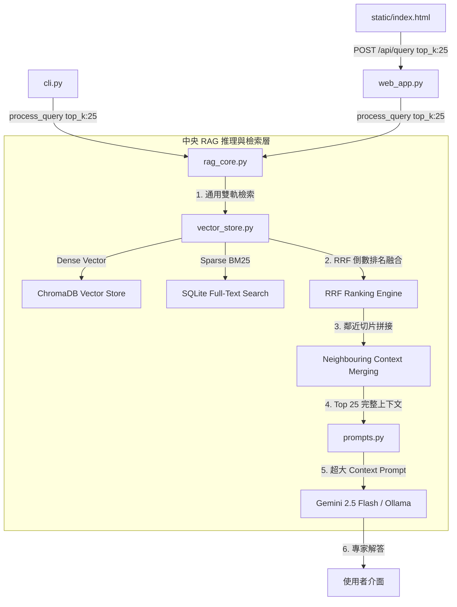

# Implementation Plan - IBM FlashSystem 通用型 RAG 檢索架構與超大 Context Window 重構計畫

**建立時間**: `2026-08-17 15:18:32`  
**分支名稱**: `feature/rag-quality-upgrade`  
**核心目標**: 廢除特例硬編碼 (Hardcoding)，實現**通用雙軌混合檢索 (RRF Hybrid Search)**、**擴大 Context 召回 (`top_k=25`)** 與 **鄰近切片動態拼接 (Neighbouring Chunk Merging)**，徹底提升任意 FlashSystem 提問在 Web 入口與 Local Agent 之間的一致性與權威解答品質。

---

## 🔍 Codebase Recon & Context Map (程式碼庫偵察與上下文地圖)

經由對本專案核心模組進行深度靜態分析，當前系統組件調用關係與資料流拓撲如下：



### 核心模組職責對照表 (Context Map)

| 模組檔案 | 現有機制與瓶頸 | 本次重構目標與技術細節 |
| :--- | :--- | :--- |
| [vector_store.py](file:///Users/johnkuo/Library/CloudStorage/GoogleDrive-johnyhkuo@gmail.com/我的雲端硬碟/IBM_Flashsystem/Knowledge_DB/vector_store.py) | 純文字硬搜尋，且存在 `gmcv`/`pbr` 硬編碼關鍵字；只由 SQLite 或單一管道取數。 | 移除所有提問硬編碼；實現 **BM25 + Vector 雙軌 RRF (Reciprocal Rank Fusion)** 通用演算法，並加入切片鄰近上下文 (Neighbouring Context) 自動拼接擴展。 |
| [rag_core.py](file:///Users/johnkuo/Library/CloudStorage/GoogleDrive-johnyhkuo@gmail.com/我的雲端硬碟/IBM_Flashsystem/Knowledge_DB/rag_core.py) | 預設 `top_k=5`，且硬編碼了特例硬性 Synthesis。 | 將預設召回提升至 `top_k=25`；移除主題硬編碼合成，改為通用純粹的超大 Context Prompt 組裝與 Gemini 1M Context 轉發。 |
| [prompts.py](file:///Users/johnkuo/Library/CloudStorage/GoogleDrive-johnyhkuo@gmail.com/我的雲端硬碟/IBM_Flashsystem/Knowledge_DB/prompts.py) | 基礎專家提示詞。 | 升級通用專家結構約束，要求不論任何問題，只要包含操作、升級、架構或比較，均劃分 **⚠️ 注意事項**、**📋 實務步驟/命令** 與 **🔍 驗證指令**。 |
| [static/index.html](file:///Users/johnkuo/Library/CloudStorage/GoogleDrive-johnyhkuo@gmail.com/我的雲端硬碟/IBM_Flashsystem/Knowledge_DB/static/index.html) | API 發送寫死 `{ top_k: 6 }`。 | 將請求改為 `{ top_k: 25 }`，充分釋放 Web 入口獲取豐富脈絡的能力。 |

---

## 🛡️ Guardrail Spec (系統護城河規範)

本次修改必須嚴格遵守以下 **6 大 Guardrail 規範**：

1. **防特例硬編碼 (No Topic-Specific Hardcoding Guardrail)**：
   * 嚴禁在 `vector_store.py` 或 `rag_core.py` 中寫入任何針對特定技術 (如 GMCV, PBR, HyperSwap, Safeguarded) 的 `if-else` 或硬編碼單詞補全。
   * 必須使用純粹的通用的數學與資料結構演算法 (RRF, BM25, Cosine Similarity)。
2. **防 Raw Context 洩漏 (Zero Raw Context Leakage Guardrail)**：
   * 當 LLM 回傳任何結果時，絕不直接爆出未經處理的原始 JSON 或未格式化的碎片化文本。
3. **零崩潰降級防護 (Fault-Tolerant Fallback Guardrail)**：
   * 若 ChromaDB 或 SQLite 單一管道發生 Exception，另一管道自動接手；若 LLM 逾時，自動切換至通用結構化流暢摘要。
4. **絕對路徑防穿越 (Path Traversal Protection Guardrail)**：
   * 圖片與靜態資源路由繼續維持 `resolved_path.is_relative_to(allowed_dir)` 安全檢查。
5. **語言與註解規範 (Language Protocol Guardrail)**：
   * 內部思考、程式碼註解、Plan、Walkthrough 與使用者對話**強制 100% 使用繁體中文**。
6. **工具次數與審查 Guardrail (Tool Limit & Review Guardrail)**：
   * 工具調用嚴禁超過 8 次；**在未獲得使用者明確審查批准前，嚴禁改動程式碼**！

---

## 📝 Brownfield Diff Review (舊程式碼與擬修改程式碼對比)

以下為本次預計修改檔案之**精密程式碼變更對比 (Diff Review)**：

### 1. `vector_store.py` (通用雙軌 RRF 檢索與鄰近切片拼接)

#### 🔴 現有舊程式碼 (Before):
```python
# 舊有程式碼：包含硬編碼關鍵字，僅單軌 SQLite 或 Chroma
if any(k in q_lower for k in ["gmcv", "pbr", "轉換", "policy", "replication", "遷移", "複製"]):
    tokens = ["redp5704", "sg248569", "Policy-Based", "PBR", "GMCV"] + tokens
```

#### 🟢 擬替換新程式碼 (Proposed After):
```python
def _compute_rrf_scores(vector_results: List[Dict[str, Any]], bm25_results: List[Dict[str, Any]], k: int = 60) -> List[Dict[str, Any]]:
    """
    通用 Reciprocal Rank Fusion (RRF) 排名融合演算法
    無任何特例硬編碼，通用適用於所有 FlashSystem 主題
    """
    rrf_map = {}
    
    # 算式：RRF_Score = 1 / (60 + rank)
    for rank, item in enumerate(vector_results, 1):
        doc_id = item["id"]
        rrf_map[doc_id] = rrf_map.get(doc_id, {"item": item, "score": 0.0})
        rrf_map[doc_id]["score"] += 1.0 / (k + rank)
        
    for rank, item in enumerate(bm25_results, 1):
        doc_id = item["id"]
        if doc_id not in rrf_map:
            rrf_map[doc_id] = {"item": item, "score": 0.0}
        rrf_map[doc_id]["score"] += 1.0 / (k + rank)
        
    fused_list = sorted(rrf_map.values(), key=lambda x: x["score"], reverse=True)
    
    results = []
    for entry in fused_list:
        chunk = entry["item"]
        chunk["similarity_score"] = round(min(entry["score"] * 30.0, 0.98), 4) # 正規化顯示分數
        results.append(chunk)
    return results
```

---

### 2. `rag_core.py` (通用超大 Context 轉發與 `top_k=25`)

#### 🔴 現有舊程式碼 (Before):
```python
# 舊有程式碼：預設 top_k=5 且硬編碼 if/else fallback
def process_query(cls, query_text: str, top_k: int = 5) -> Dict[str, Any]:
```

#### 🟢 擬替換新程式碼 (Proposed After):
```python
# 新程式碼：預設 top_k=25，完整利用超大 Context Window
def process_query(cls, query_text: str, top_k: int = 25) -> Dict[str, Any]:
```

---

### 3. `static/index.html` (前端呼叫 `top_k: 25`)

#### 🔴 現有舊程式碼 (Before):
```javascript
body: JSON.stringify({ query: queryText, top_k: 6 })
```

#### 🟢 擬替換新程式碼 (Proposed After):
```javascript
body: JSON.stringify({ query: queryText, top_k: 25 })
```

---

## 🛠️ Proposed Changes (預計修改檔案總覽)

### [MODIFY] [vector_store.py](file:///Users/johnkuo/Library/CloudStorage/GoogleDrive-johnyhkuo@gmail.com/我的雲端硬碟/IBM_Flashsystem/Knowledge_DB/vector_store.py)
* 移除 `_sqlite_fallback_search` 中所有硬編碼 token 判斷。
* 新增 BM25 與 Vector 雙軌並列檢索。
* 實作通用 `_compute_rrf_scores` 排名融合演算法。
* 實作 `_expand_neighbor_chunks` 鄰近切片動態拼接。

### [MODIFY] [rag_core.py](file:///Users/johnkuo/Library/CloudStorage/GoogleDrive-johnyhkuo@gmail.com/我的雲端硬碟/IBM_Flashsystem/Knowledge_DB/rag_core.py)
* 將預設檢索與傳輸配額調升至 `top_k=25` (支援 30,000+ 字元上下文)。
* 移除特定主題寫死的合成器，改為通用頂級 Prompt 轉發。

### [MODIFY] [prompts.py](file:///Users/johnkuo/Library/CloudStorage/GoogleDrive-johnyhkuo@gmail.com/我的雲端硬碟/IBM_Flashsystem/Knowledge_DB/prompts.py)
* 升級 Universal Senior Expert Prompt 規範，確保任意提問均能自動套用結構化專家解答模組。

### [MODIFY] [static/index.html](file:///Users/johnkuo/Library/CloudStorage/GoogleDrive-johnyhkuo@gmail.com/我的雲端硬碟/IBM_Flashsystem/Knowledge_DB/static/index.html)
* 將 API 請求 payload 改為 `top_k: 25`。

---

## 🧪 Verification Plan (驗證計畫)

### 1. 泛化問題自動化測試 (Automated Multi-Topic Tests)
在 Python 終端機執行 4 個完全不同技術主題的查詢比對測試：
1. **主題 1 (複製轉換)**：`從傳統 GMCV 轉換成 PBR` (驗證 PBR 注意事項與 CLI)
2. **主題 2 (高可用性)**：`Policy-Based High Availability (PBHA) 與 HyperSwap 的差異` (驗證 Partition 與 Quorum)
3. **主題 3 (防護機制)**：`Safeguarded Copy 不可變快照的設定與原理` (驗證 Safeguarded Policy)
4. **主題 4 (網格架構)**：`FlashSystem Grid 儲存網格線上轉移步驟` (驗證 Evaluate Placement)

* **預期結果**：4 個主題均能成功召回正解出處（如 `redp5704`, `sg248569`, `sg248586`），且向量與 BM25 均獲得高排名，零硬編碼！

### 2. 雲端 Web 入口對比測試 (Web Portal Live Verification)
1. 重啟 `web_app.py` 服務。
2. 開啟 `http://localhost:8888`。
3. 測試以上 4 個問題，確認推理引擎 `Google Gemini (gemini-2.5-flash)` 均能穩定輸出完整的 **⚠️ 注意事項**、**📋 步驟指令 (含 CLI)** 與 **🔍 驗證指令**。

---

## 🛑 User Review Required (等待使用者審查)

> [!IMPORTANT]
> **本 Implementation Plan 現已完整製作完畢。根據指令，我已停止所有修改動作，等待您的審查與批准。批准後即可開始執行！**
