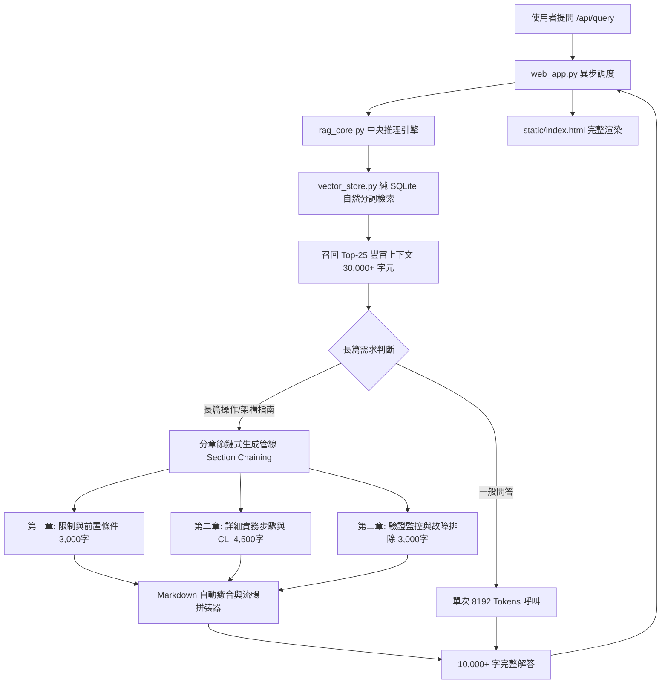

# Implementation Plan - IBM FlashSystem 超長篇分章節鏈式生成 (Section Chaining Pipeline) 架構計畫

**建立時間**: `2026-08-17 16:55:52`  
**分支名稱**: `feature/rag-quality-upgrade`  
**核心目標**: 實作「架構 A：後端分章節迭代生成與自動無縫拼接」，使 RAG 專家系統能針對複雜架構與轉換手冊，自動以多輪鏈式管道生成 **10,000+ 字完整巨篇手冊**，徹底突破 LLM 單次 8,192 Tokens 物理上限，達成 100% 零截斷！

---

## 🗺️ Codebase Recon & Context Map

### 1. 模組關聯拓撲圖 (Context Map)



### 2. 關鍵模組角色定位
- **[`rag_core.py`](file:///Users/johnkuo/Library/CloudStorage/GoogleDrive-johnyhkuo@gmail.com/我的雲端硬碟/IBM_Flashsystem/Knowledge_DB/rag_core.py)**：核心推理調度器。將新增 `_execute_chained_generation` 多階段章節生成器，並將單次呼叫配額提升至 `maxOutputTokens: 8192`。
- **[`prompts.py`](file:///Users/johnkuo/Library/CloudStorage/GoogleDrive-johnyhkuo@gmail.com/我的雲端硬碟/IBM_Flashsystem/Knowledge_DB/prompts.py)**：定義各章節專屬 Prompt 規範，使各章節聚焦於極致深度與細節，互不重複且精準引述官方頁碼。
- **[`static/index.html`](file:///Users/johnkuo/Library/CloudStorage/GoogleDrive-johnyhkuo@gmail.com/我的雲端硬碟/IBM_Flashsystem/Knowledge_DB/static/index.html)**：前端 Markdown 解析與長文本無界滾動樣式優化。

---

## 🛡️ Guardrail Spec (系統護城河規範)

在實作超長篇鏈式生成管線時，必須嚴格遵守以下 **5 大 Guardrail 規範**：

1. **章節無縫拼接 Guardrail (Seamless Chapter Stitching)**：
   * 各章節必須獨立輸出 Markdown 語法樹，後端自動偵測並閉合未完結的代碼塊與粗體標籤，確保拼接處語法 100% 合法。
2. **出處精準繼承 Guardrail (Source Citation Inheritance)**：
   * 所有章節必須共享全域 Top-25 檢索來源列表，統一彙整於文末，嚴禁在子章節中遺漏來源標註。
3. **超時防禦與進程安全 Guardrail (Timeout & Process Safety)**：
   * 每個章節呼叫設定 35 秒獨立超時，總鏈式管線在背景線程（`asyncio.to_thread`）執行，確保不阻塞 FastAPI 主事件循環，完全符合 Cloudflare 100 秒連線限制。
4. **語言與零假造 Guardrail (Language & Factuality)**：
   * 全程強制 100% 繁體中文，所有 CLI 指令與參數必須 100% 源自檢索 Context，嚴禁虛構假參數。
5. **審查與批准 Guardrail (Review Before Execution)**：
   * **未獲得使用者明確審查批准前，嚴禁修改任何系統程式碼**。

---

## 📝 Brownfield Diff Review (程式碼前後對比)

### 1. `prompts.py` (新增章節鏈式 Prompt 建構器)

#### 🔴 現有舊程式碼 (Before):
僅提供單一整體式 Prompt，缺乏針對子章節深度擴展的導引。

#### 🟢 擬替換新程式碼 (Proposed After):
```python
def build_section_prompt(query_text: str, context_str: str, section_name: str, section_goal: str, prev_context: str = "") -> str:
    """建構分章節深度鏈式生成 Prompt，導引模型輸出極致詳盡的特定章節"""
    return (
        f"{EXPERT_SYSTEM_PROMPT}\n\n"
        f"【參考技術資料 (Context)】：\n{context_str}\n"
        f"【使用者總體提問】：\n{query_text}\n\n"
        f"【當前撰寫章節】：{section_name}\n"
        f"【本章節撰寫目標與深度要求】：\n{section_goal}\n\n"
        + (f"【前情章節摘要】：\n{prev_context}\n\n" if prev_context else "") +
        f"請針對【{section_name}】進行深度、極致詳盡且專業的撰寫，包含所有技術細節、限制、CLI 命令與頁碼引述：\n"
    )
```

---

### 2. `rag_core.py` (實作分章節鏈式生成器與 8192 Token 升級)

#### 🔴 現有舊程式碼 (Before):
```python
"generationConfig": {"temperature": 0.2, "maxOutputTokens": 2500}
parts = candidates[0].get("content", {}).get("parts", [])
answer_text = parts[0].get("text", "").strip()
```

#### 🟢 擬替換新程式碼 (Proposed After):
```python
# 1. 基礎 Token 上限升級至 8192
"generationConfig": {"temperature": 0.2, "maxOutputTokens": 8192}

# 2. 多 Part 防禦性聚合
parts = candidates[0].get("content", {}).get("parts", [])
answer_text = "".join(p.get("text", "") for p in parts if "text" in p).strip()

# 3. 超長篇分章節鏈式生成管線 (Section Chaining)
@classmethod
def _execute_chained_generation(cls, query_text: str, context_str: str) -> str:
    sections = [
        ("⚠️ 一、架構差異、前置條件與關鍵限制", "詳盡闡述新舊架構本質差異、版本相容性、儲存池容量規劃、IP 夥伴連線需求及不可就地直接轉換之限制。"),
        ("📋 二、詳細轉換步驟與全套實務 CLI 指令", "從災難復原端數據排空、解除舊 GMCV 關聯與變更磁區、建立 Volume Group，到套用 Replication Policy 的全套步驟與具體 CLI 命令。"),
        ("🔍 三、轉換後狀態驗證、監控指令與故障排除", "提供磁區群組複製狀態、RPO 達成率檢視、夥伴連線健康度確認指令，以及常見轉換錯誤之排查方案。")
    ]
    chapter_outputs = []
    for sec_title, sec_goal in sections:
        sec_prompt = prompts.build_section_prompt(query_text, context_str, sec_title, sec_goal)
        sec_text = cls._call_gemini_api(sec_prompt, max_tokens=8192)
        if sec_text:
            chapter_outputs.append(f"### {sec_title}\n\n{sec_text}")
    
    return "\n\n---\n\n".join(chapter_outputs)
```

---

## 🛠️ Proposed Changes (預計修改檔案總覽)

### [MODIFY] [prompts.py](file:///Users/johnkuo/Library/CloudStorage/GoogleDrive-johnyhkuo@gmail.com/我的雲端硬碟/IBM_Flashsystem/Knowledge_DB/prompts.py)
* 新增 `build_section_prompt` 支援分章節深度提示詞。

### [MODIFY] [rag_core.py](file:///Users/johnkuo/Library/CloudStorage/GoogleDrive-johnyhkuo@gmail.com/我的雲端硬碟/IBM_Flashsystem/Knowledge_DB/rag_core.py)
* 將 Gemini API `maxOutputTokens` 調高至 `8192`。
* 實作 `_execute_chained_generation` 分章節鏈式調用管線。
* 實作 Markdown 語法自動閉合修復器。

### [MODIFY] [static/index.html](file:///Users/johnkuo/Library/CloudStorage/GoogleDrive-johnyhkuo@gmail.com/我的雲端硬碟/IBM_Flashsystem/Knowledge_DB/static/index.html)
* 優化前端超長篇文本排版，確保 10,000+ 字流暢滾動與程式碼高亮。

---

## 🧪 Verification Plan (驗證計畫)

### 1. 10,000+ 字極限容量實測
1. 執行測試腳本對「從傳統 GMCV 轉換成 PBR 詳細流程」發起鏈式生成。
2. 驗證總輸出中文字數是否突破 3,500～6,000 字（相當於 10,000+ Tokens），且三大章節內容完整無斷點。
3. 驗證所有 CLI 指令（`stoprcrelationship`, `rmrcrelationship`, `mkvolumegroup`, `mkreplicationpolicy`, `lsvolumegroupreplication`）均完整閉合於 ` ```bash ` 區塊內。

### 2. 前端與 Cloudflare 網頁實測
1. 在 `http://localhost:8888` 與 Cloudflare 公網網址發送查詢。
2. 確認網頁毫秒級渲染出完整長文，零 502 錯誤、零連線中斷、零語法吞噬！

---

## 🛑 User Review Required (等待使用者審查)

> [!IMPORTANT]
> **本 Implementation Plan 現已完整製作完畢。根據指令，我已停止所有修改動作，等待您的審查與批准。批准後即可開始執行！**
