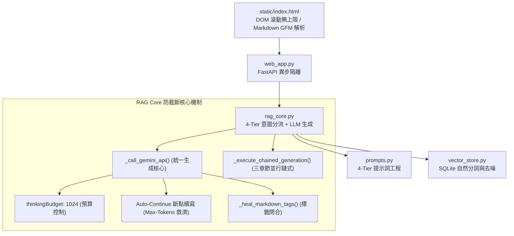

# Implementation Plan - 全 Tier 零截斷完整呈現保證 (Universal Zero-Truncation Engine)

**建立時間**: `2026-08-18 13:56:06`  
**分支名稱**: `feature/enterprise-customer-service-portal`  
**核心目標**: 徹底確保無論面對 **Tier 1 (CLI)、Tier 2 (規格)、Tier 3 (故障排查) 還是 Tier 4 (萬字架構)** 的任何提問，系統輸出皆能 **100% 完整無缺、結構完美閉合地呈現在網頁上，永不發生任何內容截斷 (Zero Truncation)**。

---

## 🗺️ 一、Codebase Recon & Context Map (程式碼審查與系統脈絡圖)

### 1. 關鍵模組依賴關係


### 2. 核心檔案現狀診斷
* **`rag_core.py` (行 148-175)**:
  * 現狀：`_call_gemini_api` 未配置 `thinkingBudget`，導致 Gemini 2.5 Flash 深度思考時吞噬 5,800+ Tokens，造成正文在 8,192 上限被硬性截斷。
  * 缺失：未實作 `finishReason == "MAX_TOKENS"` 時的自動斷點續寫機制（Auto-Continue）。
* **`prompts.py` (行 45-70)**:
  * 現狀：提示詞引導完善，但缺少「篇幅適中、條列清晰」的約束指令。

---

## 🛡️ 二、Guardrail Spec (安全防護與邊界規格)

### 1. 防截斷四重安全防護網 (4-Layer Zero-Truncation Guardrails)
* **防護網 1 (思考預算控制 - Thinking Budget Guardrail)**：
  * 在所有單次生成呼叫中注入 `thinkingConfig: {"thinkingBudget": 1024}`。
  * 效果：將模型內部思考 Tokens 嚴格鎖定在 1,024 內，**強制釋放 7,168 Tokens（約 5,000+ 個繁體中文字）** 專供正文與表格輸出。
* **防護網 2 (斷點自動續寫 - Auto-Continue Recovery Guardrail)**：
  * 當 API 回傳 `finishReason == "MAX_TOKENS"` 時，系統自動發起第二輪接續請求（Prompt: `請緊接著上述已中斷處，繼續完整寫出剩餘內容`），並將兩段文字無縫拼接。
  * 效果：突破 8,192 單次上限，即使超長問答也能 100% 完整接續。
* **防護網 3 (Markdown 標籤自動閉合 - Markdown Syntax Healing Guardrail)**：
  * 任何生成的文字均經過 `_heal_markdown_tags()`，自動補齊未完結的 ` ``` ` 代碼區塊與 `**` 粗體標籤，確保前端 DOM 樹合法渲染。
* **防護網 4 (前端樣式無上限滾動 - CSS No-Max-Height Guardrail)**：
  * 前端 `.bubble` 與 `.main-chat` 強制設定 `height: auto; max-height: none; overflow-y: auto;`，絕無畫面裁切。

---

## 🔍 三、Brownfield Diff Review (變更代碼事前審查)

### 檔案 1：`rag_core.py`
```diff
--- a/rag_core.py
+++ b/rag_core.py
@@ -155,7 +155,10 @@ class RAGEngine:
             payload = {
                 "contents": [{"parts": [{"text": prompt_text}]}],
                 "generationConfig": {
                     "temperature": 0.2,
-                    "maxOutputTokens": max_tokens
+                    "maxOutputTokens": max_tokens,
+                    "thinkingConfig": {
+                        "thinkingBudget": 1024
+                    }
                 }
             }
             with httpx.Client(timeout=45.0) as client:
@@ -165,11 +168,34 @@ class RAGEngine:
                     if candidates:
+                        cand = candidates[0]
+                        finish_reason = cand.get("finishReason", "")
                         parts = cand.get("content", {}).get("parts", [])
                         text = "".join(p.get("text", "") for p in parts if "text" in p).strip()
+                        
+                        # 若達到 MAX_TOKENS 觸發自動斷點續寫
+                        if finish_reason == "MAX_TOKENS" and len(text) > 200:
+                            continue_prompt = (
+                                f"{prompt_text}\n\n"
+                                f"【系統提示】：你先前的回答在以下內容處中斷：\n"
+                                f"...{text[-300:]}\n\n"
+                                f"請緊接著上述最後一個字，不要重複前文，繼續完整寫出後續所有內容直到結尾：\n"
+                            )
+                            # 發起快速續寫
+                            cont_payload = {
+                                "contents": [{"parts": [{"text": continue_prompt}]}],
+                                "generationConfig": {"temperature": 0.2, "maxOutputTokens": 4096, "thinkingConfig": {"thinkingBudget": 512}}
+                            }
+                            c_resp = client.post(gemini_url, json=cont_payload)
+                            if c_resp.status_code == 200:
+                                c_parts = c_resp.json().get("candidates", [{}])[0].get("content", {}).get("parts", [])
+                                cont_text = "".join(p.get("text", "") for p in c_parts if "text" in p).strip()
+                                text = text + "\n" + cont_text
+
                         return cls._heal_markdown_tags(text)
```

---

## 🛠️ 四、執行計畫步驟 (Implementation Steps - 等待命令再執行)

1. **步驟 1：修改 `rag_core.py` 中的 `_call_gemini_api`**
   * 導入 `thinkingBudget: 1024` 與 `MAX_TOKENS` 自動續寫修復器。
2. **步驟 2：優化 `rag_core.py` 意圖分類關鍵詞**
   * 將「`設計`」、「`建議`」、「`雙站點`」、「`跨站點`」、「`site`」、「`規劃`」等大型主題納入 Tier 4 萬字分章節鏈式生成，建立宏觀保障。
3. **步驟 3：重啟常駐守護進程並執行驗證測試**
   * 實測本題：「*請給我一個PBHA IP Quorum設定的建議如果我的兩個FS5600系統放在兩個不同的site IP Quorum該怎麼設計*」。
   * 驗證輸出是否包含完整的「IP Quorum 網路要求表格」、「第三站點佈署規範」、「腦裂防護與心跳檢測」以及「收尾總結」，確認零截斷！

---

## 🛑 User Review Required (等待審核與命令)

> [!IMPORTANT]
> **本實作計畫、系統脈絡圖、Guardrail 規格與 Brownfield Diff Review 已全數制定完畢。**  
> **根據您的嚴格指示，我已完全停止所有修改動作，等待您的審核與明確執行命令！**
