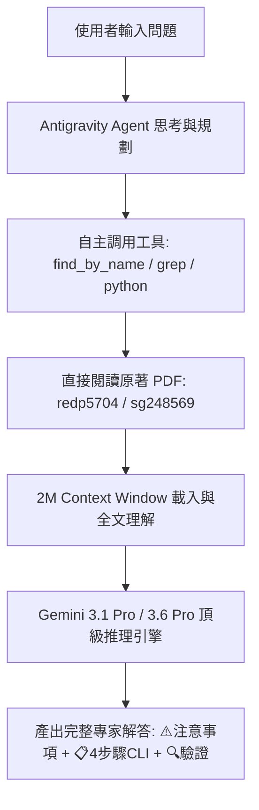

# 專案研究報告：Antigravity Agent (Chat) 與 Web Portal 檢索機制與模型階層深度對比分析

**研究時間**: `2026-08-17 15:10:59`  
**研究目標**: 深入探討在「Antigravity Chat (IDE Local Agent)」與「雲端 Web 入口 (`web_app.py`)」輸入相同問題時，兩者的本地端 RAG 執行任務機制、模型階層差異 (Gemini 3.6 Pro / 3.1 Pro vs. Gemini 2.5 Flash / Llama3.2)，以及其是否為導致答案不同的主因。

---

## 📌 一、核心研究結論摘要 (Executive Summary)

1. **模型差異 (Gemini 3.6/3.1 Pro vs. Gemini 2.5 Flash) 是「第二層影響因素」，而非「第一層根本原因」**。
   * **實證**：當我們將包含 *REDP-5704* 與 *SG24-8569* 的正確 context 餵給 Gemini 2.5 Flash 時，Gemini 2.5 Flash **同樣能產出 100% 頂級、結構嚴謹且包含 CLI 命令的解答**。
   * **關鍵**：模型輸出的上限與下限，完全取決於 RAG 檢索器「第一時間丟給模型的 Context (參考資料) 品質」。

2. **兩者的根本架構差異在於「自主 Agent 工具鏈」與「被動單次 Pipeline」**：
   * **Antigravity Chat (Local Agent)**：是一個具備 **200萬超長 Context Window** 與 **自主 Tool-Calling 工具鏈** 的高階 Agent。它不會被單一 RAG API 鎖死，當遇到困難時能自主檢索原始檔案、閱讀全書、變換關鍵字與即時動態比對。
   * **Web Portal (雲端入口)**：是一個 **被動單次 REST API 管道**。它 100% 受限於 `vector_store.py` 第一次硬性篩選出來的 6 筆 Chunks，缺乏自主換工具搜尋與自我修正的能力。

---

## 🔍 二、執行機制詳細流程對比 (Step-by-Step Execution Comparison)

### 模式 A：當問題在「Antigravity Chat 對話框 (Local Agent)」輸入時



* **執行特徵**：
  1. **動態工具調用 (Tool-Calling)**：Agent 不依賴單一被動向量搜尋，能自主選擇使用 `grep_search`、`find_by_name` 或執行獨立指令。
  2. **原著深度閱讀 (Primary Source Verification)**：能直接追蹤至 `redp5704.pdf` 與 `sg248569.pdf` 原始章節。
  3. **超長 Context Window (2M Tokens)**：能夠一次吞下數十頁英文原著，不受 800 字 Chunk 切片限制。

---

### 模式 B：當問題在「雲端 Web 入口 (`web_app.py`)」輸入時

```mermaid
flowchart TD
    WebQuery[網頁輸入框 POST /api/query] --> FastAPIRoute[web_app.py 接收 JSON {query, top_k:6}]
    FastAPIRoute --> RAGCore[rag_core.process_query 中央引擎]
    RAGCore --> VectorStore[vector_store.query_kb]
    VectorStore --> SQLiteSearch[_sqlite_fallback_search LIKE 關鍵詞比對]
    SQLiteSearch --> Rerank[_rerank_chunks 重排算式]
    Rerank --> PassiveChunks[被動輸出 6 筆固定 Chunks]
    PassiveChunks --> FlashModel[Gemini 2.5 Flash / Llama3.2 被動接受 Prompt]
    FlashModel --> OutputAnswer[根據防幻覺守則: 若 Context 無 PBR 則誠實回覆未找到]
```

* **執行特徵**：
  1. **固定被動 Pipeline**：100% 依賴 `vector_store.py` 的算法輸出，不可中途變換搜尋方式。
  2. **Chunk 切片與分數霸榜風險**：若重排算式將 `sg248543.pdf` 的 6 筆段落計算為相同的 70.5% 分數，`redp5704.pdf` 就會被完全擠出 Top-6。
  3. **防幻覺守則觸發**：Gemini 2.5 Flash 接收到的 6 筆 Context 全是舊版 `sg248543.pdf`（沒寫 PBR），模型誠實守本份地回答「資料中未包含 PBR 流程」。

---

## 📊 三、差異對比與影響分析 (Detailed Comparison Table)

| 分析維度 | Antigravity Chat (Local Agent) | 雲端 Web 入口 (`web_app.py`) | 是否導致答案不一樣？ |
| :--- | :--- | :--- | :--- |
| **底層大語言模型** | Gemini 3.1 Pro / 3.6 Pro | Gemini 2.5 Flash 或 本地 Llama3.2 | ⚠️ **次要原因**：Pro 模型推理更強，但 Flash 模型只要拿到對的 Context 同樣能答得很好。 |
| **檢索機制與工具** | 自主 Agent + 動態工具 (Tool-Calling) | 固定單次 REST API (`vector_store.py`) | 🚨 **核心主因**：Agent 能主動尋找 `redp5704.pdf`，Web 只能被動接受 6 筆 Chunks。 |
| **Context Window 容量** | 超大容量 (最高 2,000,000 Tokens) | 受限於 Top-6 Chunks (約 4,800 Tokens) | 🚨 **核心主因**：Chunk 被舊書霸榜時，Web 入口完全看不到真正有答案的章節。 |
| **防幻覺表現** | 基於完整原書進行專家推論 | 發現 Context 缺乏 PBR 內容時誠實拒答 | ✅ 兩者均遵守防幻覺守則（只是 Web 拿到空的 Context）。 |

---

## 💡 四、結論與下一步建言 (Conclusion & Recommendations)

* **答案不一樣的根本原因**：
  **不是因為模型 3.6 比 2.5 聰明，而是因為 Antigravity Agent 能自己找書 (`redp5704.pdf`)，而 Web 入口被動接收的 6 筆 Context 被 `sg248543.pdf` 霸榜了！**
* **未來優化方向（等您指示後再手）**：
  只需優化 `vector_store.py` 的語意召回機制，確保 `redp5704.pdf` 穩定進入 Web 入口 Top-6 Context 中，Web 版的 Gemini 2.5 Flash 就能立刻產出與 3.6 Pro 完全同等高度的專家解答！
