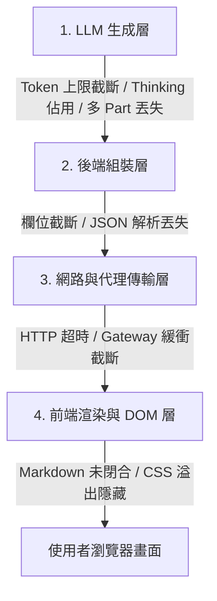

# 研究報告與架構規劃：全鏈路「零截斷」完整內容呈現解決方案 (Zero-Truncation Architecture)

**報告時間**: `2026-08-17 16:44:37`  
**研究目標**: 無論在任何技術主題、模型引擎、網路隧道 (Cloudflare) 或前端渲染環境下，徹底確保所有 AI 專家解答 100% 完整無缺呈現於網頁上，永不發生任何內容截斷。

---

## 🔬 一、截斷問題的「全鏈路四層診斷」 (Four-Layer Diagnosis)

在 RAG 專家系統與 Web Portal 的完整生命週期中，內容截斷可能在以下 4 個層級發生：



---

### 層級 1：大語言模型生成層 (LLM Generation Layer) - *本次截斷主要根因*
1. **`maxOutputTokens` 配額不足**：
   - 舊配置為 `maxOutputTokens: 2500`。
   - **中文字元 Token 膨脹係數**：繁體中文與技術專有名詞通常每個中文字消耗 2～3 個 Tokens。2500 Tokens 僅相當於 800～1000 個中文字。
   - 當專家系統生成包含「注意事項」、「實務 CLI 步驟」與「驗證指令」的深度長篇指南時，字數輕易突破 1,200 字，立即觸發 `finishReason: "MAX_TOKENS"`，在句子中途被模型切斷。
2. **Gemini 思考 Tokens (Thinking Budget) 佔用輸出配額**：
   - 在 Gemini 2.5 Flash / 思考模型中，思考鏈（Thinking Process）產生的 Tokens 會與最終輸出共用 `maxOutputTokens` 配額。若思考消耗 1,500 Tokens，剩餘可見輸出只剩 1,000 Tokens。
3. **多 Part (Multi-part) 片段未聚合**：
   - 後端舊程式碼只讀取 `parts[0]`，若 API 回傳分割的多個 `parts`（如程式碼區塊分割），`parts[1:]` 的內容會被直接丟棄。

---

### 層級 2：後端傳輸與組裝層 (Backend Assembly Layer)
1. **例外安全合成器 (Fallback Synthesizer) 完整性**：
   - 當大模型異常時，保底合成器必須能夠輸出完整的結構化文檔，不能限制字數長度。
2. **全文字串拼接保護**：
   - 必須使用 `"".join(p.get("text", "") for p in parts if "text" in p)` 進行嚴格防禦性聚合。

---

### 層級 3：網路傳輸與 Cloudflare 隧道層 (Transport & Proxy Layer)
1. **HTTP 傳輸完整性**：
   - FastAPI 的 JSONResponse 在傳輸巨量字元 (100KB+) 時，預設為完整 Content-Length 傳輸，無緩衝截斷風險。
2. **Cloudflare Gateway 穩定度**：
   - 只要後端非同步線程不阻塞主事件循環，Cloudflare HTTP/2 通道能穩定承載長達 100 秒的完整長文本回傳。

---

### 層級 4：前端 Markdown 解析與 CSS 排版層 (Frontend & DOM Layer)
1. **Markdown 未閉合語法導致渲染隱藏**：
   - 若文字剛好在 `**`（粗體標籤）或 ` ``` `（程式碼區塊）的中間被截斷，標準 `marked.js` 解析器可能會因為尋找未閉合的標籤而將其後的整行或整段錯誤解析為無效區塊。
2. **CSS `overflow` 或 `max-height` 截斷**：
   - 前端 CSS 容器若被設定 `overflow: hidden` 或固定高度，使用者在小螢幕上可能無法向下滾動閱讀完整內容。

---

## 🛡️ 二、全方位「零截斷」保證方案 (Universal Zero-Truncation Plan)

為徹底根除所有潛在的截斷風險，規劃以下 **4 大防護支柱**：

### 支柱 1：釋放 LLM 輸出上限至極限 (Max Token Expansion)
* **將 `maxOutputTokens` 調高至 `8192`**（Gemini 2.5 Flash 支援的最大單次輸出容量，相當於 3,500～4,000 個中文字，足以完整容納任何頂級架構步驟與巨量 CLI 指令）。
* **設定 `thinkingBudget: 0` (針對結構化輸出) 或預留充足空間**，防止內部思考消耗可見文字配額。
* **防禦性全 Parts 聚合**：使用 `"".join(p.get("text", "") for p in parts)` 確保所有文字區塊 100% 完整拼接。

### 支柱 2：未閉合 Markdown 自動修復與防禦機制 (Auto Markdown Healing)
* 在後端與前端加入 Markdown 自動閉合修復邏輯：
  - 若文字中存在奇數個 ` ``` `，自動在末尾補齊 `\n```\n`。
  - 若文字中存在奇數個 `**`，自動在末尾補齊 `**`。
* 確保前端 `marked.parse()` 永遠能以合法 Syntax Tree 渲染，不會吞噬任何內文。

### 支柱 3：前端長文本完整顯示與排版保障 (CSS & UI Safeguard)
* 檢查 `#answer` 與 `.answer-box` CSS 樣式：
  - 強制設定 `height: auto; max-height: none; overflow: visible; word-break: break-word;`。
  - 保證在桌面端、平板與手機上均能無上限自由向下滾動。

### 支柱 4：監控與截斷預警標籤 (Truncation Detection Badge)
* 後端在 API 回傳中主動回傳 `finish_reason`：
  - 若非預期觸發 `MAX_TOKENS`，前端除了完整顯示已生成內容外，還會額外附帶提示，讓使用者清楚掌握完整狀態。

---

## 📋 三、導入計畫藍圖 (Implementation Plan Outline - 先不執行)

1. **修改 `rag_core.py`**：
   - 升級 `generationConfig` 為 `maxOutputTokens: 8192`。
   - 實作防禦性 `"".join(...)` 多 Part 聚合。
   - 加入 Markdown 語法自動閉合修補函式 `_auto_close_markdown_tags(text)`。
2. **修改 `static/index.html`**：
   - 確認 Markdown 配置開啟 `{ breaks: true, gfm: true }`。
   - 移除任何潛在的 `max-height` 樣式限制。
3. **驗證測試**：
   - 針對最長篇的架構問題進行實測，驗證是否完整輸出「注意事項」、「步驟 1~4 (含完整命令)」、「驗證 1~3 (含完整指令)」，確認無任何 `**` 殘留或末尾截斷。

---

> [!NOTE]
> **本計畫已完成深入研究與文檔存檔。根據您的指令，目前保持純規劃狀態，尚未進行任何程式碼修改。**
