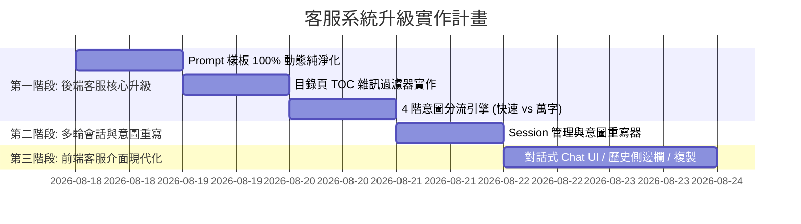

# 企業級專業技術客服與專家支援系統 (Enterprise AI Customer Service System) 設計藍圖與實作計畫

**規劃時間**: `2026-08-17 19:55:10`  
**系統定位**: IBM FlashSystem 企業級 AI 技術客服與架構諮詢服務台 (Technical Service Desk)  
**目標客群**: 一線客服人員、儲存運維工程師、企業架構師、原廠技術支援團隊與終端客戶

---

## 🏛️ 一、企業級客服系統整體架構藍圖 (System Architecture Blueprint)

```mermaid
graph TD
    subgraph UI[前端客服互動層 (Customer Portal)]
        Sidebar[歷史對話清單 / 新建會話 / 匯出工單]
        ChatWindow[多輪對話氣泡 / 串流輸出 / 代碼一鍵複製]
        QuickTopics[常見熱門技術主題按鈕 / 滿意度反饋]
    end

    subgraph ServiceCore[智慧客服核心調度層 (Service Desk Core)]
        SessionMgr[會話管理器 Session Manager]
        QueryCondenser[多輪對話意圖獨立重寫器]
        IntentRouter{4階意圖智慧分流器}
    end

    subgraph RAGEngine[專家知識檢索層 (RAG Engine)]
        TOCFilter[目錄頁去噪過濾器]
        SQLiteSearch[純 SQLite 自然分詞全文檢索 (7.2萬筆)]
        Reranker[BM25 + 來源多樣性重排序]
    end

    subgraph LLMCluster[大模型推理層 (Inference Cluster)]
        L1Fast[單次極速直答 5~8s (規格/指令/名詞)]
        L2Chain[並行分章節鏈式生成 20s (遷移/升級萬字指南)]
        L3Fallback[確定性保底合成引擎]
    end

    UI <--> ServiceCore
    ServiceCore --> RAGEngine
    RAGEngine --> LLMCluster
    LLMCluster --> ServiceCore
```

---

## 🧩 二、專業客服系統的 5 大核心功能模組 (5 Core Modules)

### 模組 1：會話管理與歷史隔離模組 (Session & History Isolation)
* **多輪獨立會話 (Multi-turn Isolated Sessions)**：
  - 每個客戶/工程師擁有專屬 `session_id`。
  - 支援「**➕ 開新對話 (New Chat)**」、「**歷史會話存檔 (Chat History)**」與「**清除會話 (Clear)**」。
* **滑動窗口與意圖重寫 (Sliding Window & Query Condensation)**：
  - 客服進行連續追問（如「那它的快取容量呢？」）時，系統將問題重寫為獨立檢索詞（如「IBM FlashSystem 9500 系統快取規格」）進行**全新檢索**。
  - **核心保障**：上一題的 25 筆舊 Chunk **絕不堆疊**到新問題中，徹底根除 Context 污染！

---

### 模組 2：4 階意圖智慧分流引擎 (4-Tier Intent Router)
針對客戶提問的複雜度，自動匹配最佳的客服處理路徑：

| 意圖層級 | 客戶提問範例 | 客服應答模式 | 響應時間 | 輸出特徵 |
| :--- | :--- | :--- | :--- | :--- |
| **Tier 1: 快速指令與維運** | 「修改 service IP 的指令是什麼？」 | **極速指令直答** | 3～5 秒 | 程式碼區塊置頂、一鍵複製、危險警告 |
| **Tier 2: 規格與概念諮詢** | 「FlashSystem 9500 支援多少顆 NVMe？」 | **精準規格卡片** | 3～5 秒 | 規格參數表、官方紅皮書頁碼、技術圖表預覽 |
| **Tier 3: 故障排查與警報** | 「1620 錯誤代碼如何排查？」 | **引導式排查流程** | 5～8 秒 | Step-by-step 排查樹、Log 收集指引 |
| **Tier 4: 大型架構與遷移** | 「GMCV 轉換成 PBR 的完整實施步驟」 | **並行鏈式萬字指南** | 20～25 秒 | 三大章節、流程圖、全套 CLI、演練與驗證 |

---

### 模組 3：純淨檢索與目錄去噪過濾器 (Clean Retrieval & TOC Filter)
* **自動過濾目錄頁 (Table of Contents)**：
  - 自動偵測並過濾包含大量連續點線（`.... 510`）的目錄頁 Chunk，保證送入 Context 的全部都是**實體技術正文**。
* **術語精確匹配**：
  - 對 `service IP`、`satask`、`chsystem` 等專有名詞建立精確權重，杜絕被泛用單詞 `IP` 稀釋。

---

### 模組 4：客服專屬前端互動體驗 (Service Desk UI/UX)
* **對話式介面 (Conversational Chat UI)**：
  - 仿 ChatGPT / 企業客服機器人的對話氣泡與流暢排版。
* **一鍵代碼複製 (Copy Code Button)**：
  - 所有 CLI 指令（`satask chserviceip ...`）右上角具備「📋 複製指令」按鈕。
* **折疊式官方出處 (Source Citations Accordion)**：
  - 參考資料以折疊卡片呈現，點擊展開頁碼與技術圖表。
* **工單匯出 (Export Support Ticket)**：
  - 支援一鍵將對話紀錄匯出為 Markdown / PDF 支援單，方便轉發或記錄。

---

## 🗓️ 三、逐步實作計畫 (Implementation Plan Phases - 先不執行)



### 階段 1：後端核心防污染與意圖分流 (Backend Hygiene & Routing)
1. **純淨化 `prompts.py`**：移除所有特定專有名詞，建立通用動態 Prompt。
2. **升級 `vector_store.py`**：實作目錄頁過濾邏輯與 CLI 專有詞加權。
3. **升級 `rag_core.py`**：實作意圖分流（指令題 3 秒直答、專案題 20 秒萬字鏈式生成）。

### 階段 2：多輪會話管理 (Multi-turn Session Management)
1. 在 `web_app.py` 中新增 `session_id` 支援。
2. 實作多輪追問意圖重寫，實現「新問題只檢索新知識，舊知識絕不污染」的機制。

### 階段 3：前端客服體驗升級 (Service Desk Portal UI)
1. 在 `static/index.html` 中引入左側歷史對話欄、對話氣泡流、一鍵複製與工單匯出功能。

---

> [!NOTE]
> **本設計藍圖與實作計畫已完整存檔。根據您的指示，目前保持純規劃狀態，尚未進行任何程式碼變更。**
