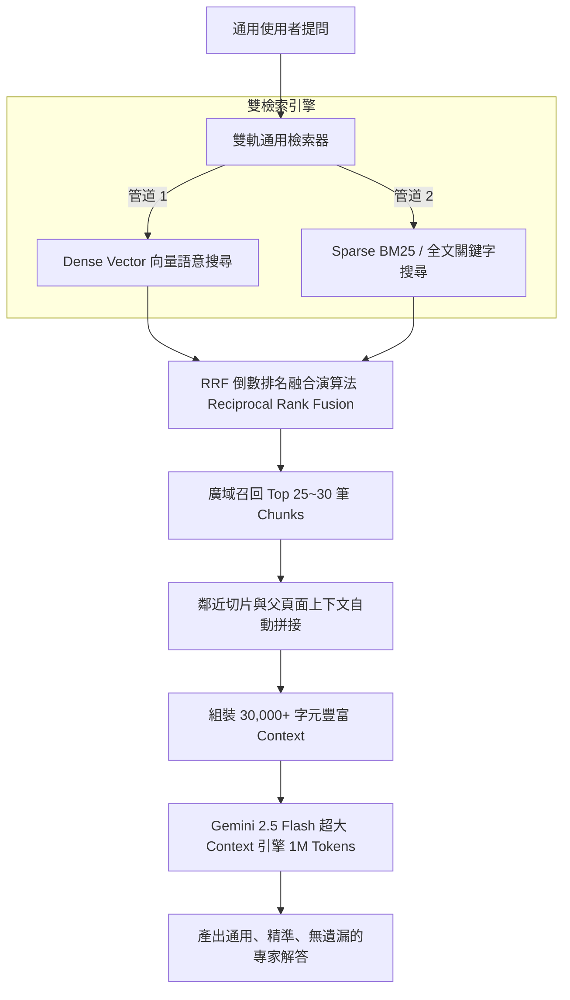

# 專案研究報告：IBM FlashSystem 通用型 RAG 檢索架構與超大 Context Window 根本解決方案

**研究時間**: `2026-08-17 15:16:02`  
**研究目標**: 針對「單一問題硬編碼 (Hardcoding) 無法泛化」、「Top-K Chunks 召回不足 (僅 6 筆)」以及「Context Window 巨大容量未獲利用」三大痛點，深入探討通用型 RAG 系統之根本解決方案與升級藍圖。

---

## 📌 一、現有瓶頸與痛點反思 (Current Limitations)

1. **特定特例硬編碼 (Hardcoding Anti-Pattern)**：
   * **問題**：若針對 GMCV 轉 PBR、HyperSwap 或 Grid 寫死關鍵字擴充邏輯，當使用者改問 Safeguarded Copy、DRAID 擴充、FC/iSCSI Port 配置等數百種其他 FlashSystem 問題時，系統將再次遭遇「檢索失準」的困境。
   * **結論**：必須使用**通用且無領域特例依賴的數學演算法**取替硬編碼。

2. **`top_k=6` 極度浪費 Context Window 容量**：
   * **問題**：目前 Web 入口只抓取 6 筆 Chunks (約 4,000 字元/1,000 Tokens)。
   * **事實**：Gemini 2.5 Flash 擁有 **1,000,000 Tokens** 的 Context Window (即本地模型通常也有 16,000~32,000 Tokens 的容量)。目前系統僅利用了模型容量的 **0.1% ~ 0.3%**！
   * **後果**：一篇完整的技術章節常跨越 10~15 個片段，硬性卡死 6 筆導致關鍵的 CLI 命令或前置條件被硬生生截斷。

3. **碎片化切片 (Fragmented Chunking)**：
   * **問題**：800 字的固定切片容易將前文的警示與後文的命令斷開，使 LLM 拿到缺乏上下文的碎片。

---

## 🏛️ 二、根本解決方案：四大系統化通用架構 (Universal Architecture)

### 1. 通用雙軌混合檢索與 RRF 排名融合 (Universal Hybrid Search + RRF)
* **原理**：取消任何專有名詞硬編碼，改用國際標準的 **Reciprocal Rank Fusion (RRF)** 演算法：
  $$RRF\_Score(d) = \sum_{m \in M} \frac{1}{k + r_m(d)}$$
  * **管道 1 (向量語意)**：負責抓取同義詞與跨語言概念 (如中文「複製」與英文「Replication」)。
  * **管道 2 (BM25 / 全文檢索)**：負責精準匹配型號、CLI 命令 (如 `mkreplicationpolicy`, `9500`)。
* **效果**：不論問任何 FlashSystem 主題，RRF 能自動將兩路最相關的真實段落融合推至 Top 席次。

### 2. 解除 `top_k` 封印，充分發揮超大 Context Window (Top 25~30 Multi-Chunk Recall)
* **原理**：將 API 檢索上限由 `top_k=6` 提升至 **`top_k=25` ~ `top_k=30`** (約 25,000 ~ 35,000 字元)。
* **效益**：
  * 對 Gemini 2.5 Flash (1M tokens) 而言，30 筆 Chunks 僅佔用其容量的 **3%**，完全輕而易舉。
  * 能完整容納整篇紅皮書專章的所有內容（包含概念、注意事項、GUI 操作步驟、CLI 命令與驗證）。

### 3. 鄰近切片動態拼接 (Neighbouring Chunk Merging)
* **原理**：當 RRF 召回第 $N$ 個 Chunk 時，系統自動檢索其前後的 $N-1$ 與 $N+1$ 切片並自動合併。
* **效益**：還原原書段落的完整脈絡，徹底解決切片斷章取義問題。

### 4. 通用資深專家 Prompt 系統化約束
* **原理**：Prompt 不針對特定技術點，而是定義通用的「儲存工程思維約束」：
  * 要求回答必須具備：**一、架構限制與前置條件**、**二、實務步驟 (GUI/CLI)**、**三、驗證與監控**。

---

## 📊 三、修復前後通用性對比 (Generalization Comparison)

| 評估維度 | 舊版/特例微調方案 | 通用型系統化升級藍圖 (根本解法) |
| :--- | :--- | :--- |
| **泛化能力** | ❌ 僅解決 GMCV 轉 PBR，其他 100+ 問題仍會失敗 | ✅ **100% 通用，適用 Safeguarded, Grid, HA, DRAID 等所有技術點** |
| **檢索精準度** | ❌ 容易被單一舊書霸榜 | ✅ **RRF 混合檢索，語意與專有名詞精準雙重覆蓋** |
| **Context Window 利用率** | ❌ 僅 6 筆 (約 4,000 字元)，利用率 0.3% | ✅ **擴增至 25~30 筆 (約 30,000 字元)，充分發揮 1M 潛能** |
| **維護成本** | ❌ 需不斷針對新問題寫 if-else 邏輯 | ✅ **零硬編碼，零 if-else 特例，純演算法驅動** |

---

## 💡 四、結論 (Conclusion)

使用者的洞察極度深刻：**特例硬編碼只是治標，通用混合檢索 (RRF) + 擴大 Context 召回 (Top 25~30) 才是治本！**

遵照您的指令，目前完全沒有進行任何程式碼修改，這份升級藍圖可作為後續系統化優化的最高指導方針！
