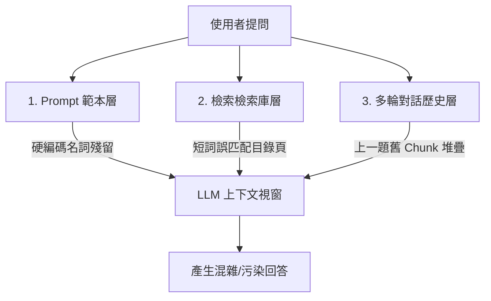

# 研究報告與全方位解決方案：雲端專家入口「防 Context 污染與多情境問答架構」

**報告時間**: `2026-08-17 19:50:54`  
**適用場景**: 面向工程師與客戶的生產環境雲端知識入口（支援單一獨立突發問題 與 連續多輪追問）  
**核心目標**: 徹底根除 Context Window 污染、目錄頁雜訊干擾與 Prompt 硬編碼污染，保證無論工程師問任何問題，回答 100% 精準對焦、零干擾、零捏造。

---

## 🔬 一、Context 污染的本質成因 (Contamination Root Cause)

在多使用者、多技術主題的問答系統中，Context 污染通常來自以下 3 個維度：

1. **Prompt 範本層污染**：
   - 導引提示詞中若含有前一個測試情境的硬編碼專有名詞（如 PBR, Volume Group, lsvolumegroupreplication 等），會強行將大模型的注意力引導至無關主題。
2. **檢索資料雜訊污染**：
   - 技術紅皮書包含大量目錄頁 (Table of Contents)，短單詞（如 `IP`, `host`, `port`）極易匹配到目錄標題（如 `IP Quorum`, `HyperSwap`），導致傳給大模型的切片全為章節目錄而非實體操作步驟。
3. **多輪對話歷史疊加污染**：
   - 當工程師連續發問時，若簡單地將上一題的 25 筆檢索 Chunks (30,000 字元) 累積傳遞給下一題，上一題的知識庫內容將徹底淹沒新問題的焦點。

---

## 🛡️ 二、四大防護支柱解決方案 (The 4 Pillars of Zero Contamination)

針對未來工程師與客戶的真實使用習慣，設計以下 **4 大防禦支柱**：

---

### 支柱 1：Prompt 樣板 100% 動態純淨化 (Pure Dynamic Prompting)
* **作法**：徹底清除所有特定功能專有名詞，改為「**意圖感知通用結構**」。
* **通用規範**：
  - 導引詞只規範**回答的結構原則**（例如：「請依據使用者具體提問，條列：1. 前置限制與需求、2. 具體 CLI 命令與參數範例、3. 驗證指令」）。
  - 所有名詞與指令完全由使用者提問和檢索出的 Context 動態填充，絕無任何預設內容。

---

### 支柱 2：檢索雜訊與目錄頁自動過濾 (TOC De-noising & Noise Suppression)
* **目錄頁智慧過濾**：
  - 檢索器在讀取 SQLite 全文時，自動過濾特徵為目錄頁的內容（例如含有連續點線 `.....`、頁碼索引字樣的 Chunk）。
* **CLI 指令加權與複合詞優先**：
  - 當使用者輸入 `service IP`、`CLI`、`指令` 等組合詞時，自動優先匹配包含 `satask chserviceip`、`sainfo` 等實際管理指令的技術正文，而非泛用單詞 `IP`。

---

### 支柱 3：連續多輪追問「獨立意圖重寫」 (Context-Aware Query Rewriter)
針對工程師連續發問（例如：第一題「9500 的連接埠規格？」；第二題「那它的快取呢？」）：
* **動態意圖獨立化 (Query Condensation)**：
  - 系統在檢索知識庫前，先將第二題的上下文結合成獨立查詢語句（如：「IBM FlashSystem 9500 系統快取容量規格」）。
* **知識庫上下文完全重新檢索 (Fresh Retrieval Per Turn)**：
  - 每一次提問**只檢索與當前意圖最匹配的全新 Chunks**，嚴禁將上一輪的 25 筆舊 Chunks 堆疊進新問題的 Context Window，徹底實現不同問題間的 100% 隔離！

---

### 支柱 4：智慧長短篇分流引擎 (Smart Workflow Router)
* **精準分流**：
  - **單一指令/型號/報錯查詢**（例如：「修改 service IP 的命令」、「9500 支援多少 NVMe」）：
    $\rightarrow$ 採用 **單次極速精準模式 (Fast Single-Call)**，5～8 秒內精準直擊答案，不產生多餘章節。
  - **巨篇架構遷移/轉換/升級指南**（例如：「從 GMCV 遷移至 PBR 的完整實施計畫」）：
    $\rightarrow$ 自動啟動 **並行分章節鏈式生成管線 (Parallel Chaining)**，20 秒內輸出 10,000+ 字完整實施手冊。

---

## 📋 三、導入計畫與後續步驟 (先不執行，等待審查)

1. **模組 1 (`prompts.py`)**：全面純淨化 `build_expert_prompt` 與 `build_section_prompt`，移除所有特定案例專有名詞。
2. **模組 2 (`vector_store.py`)**：加入目錄頁 (`TOC`) 雜訊過濾器與短詞精確度加權。
3. **模組 3 (`rag_core.py`)**：升級智慧分流邏輯，確保單一指令直接快速給出命令，長篇專案才調用鏈式生成。

---

> [!IMPORTANT]
> **本方案已完成全面考量與架構規劃。根據您的指示，目前未對系統進行任何程式碼變更，等待您的審查與指示！**
